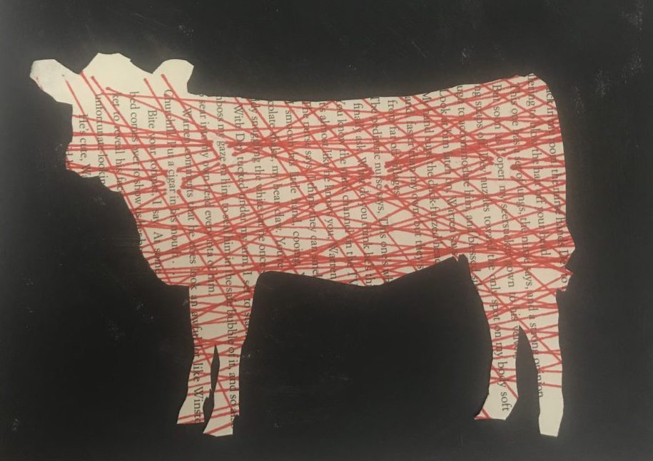

---
# Feel free to add content and custom Front Matter to this file.
# To modify the layout, see https://jekyllrb.com/docs/themes/#overriding-theme-defaults

layout: home
---
## Multidisciplinary Artist
Alison Bergblom Johnson is a multidisciplinary artist; performance, lit, collage, and installation are part of her practice. Her work engages with such topics as disability, trauma, and joy.

